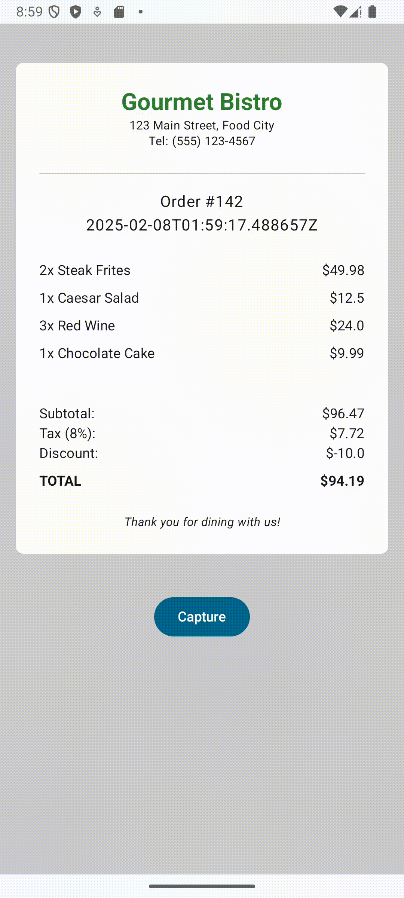
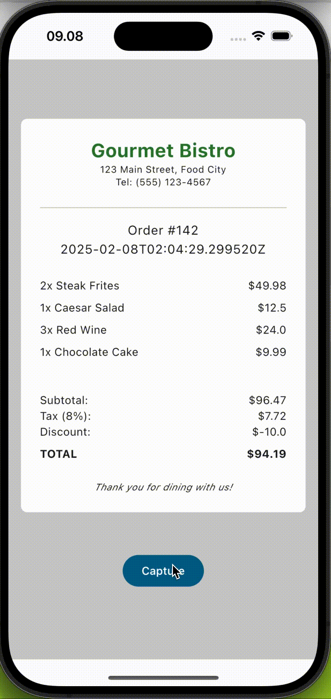

# Kotlin Multiplatform Screenshot Library for Jetpack Compose

A lightweight Kotlin Multiplatform library for capturing Jetpack Compose composables as image bitmaps. Supports Android and iOS. Easily take screenshots of your composables for testing, previews, or sharing.

### 🚀 Features:
- Capture any composable as an image bitmap
- Supports Jetpack Compose on Android and iOS
- Easy-to-use API for seamless integration

### 🎥 Demo

📱 Android Demo           |  🍏 iOS Demo
:-------------------------:|:-------------------------:
  |  

### 📦 Installation & Usage:
Simply add the dependency and start capturing your composables!

```kotlin
implementation("io.github.suwasto:kmp-capturable-compose:0.1.0")
```

### 🚀 Usage Example
Start by creating a CaptureController to manage the capture process and trigger captures programmatically.

For a complete example, check out the [sharedUi](sharedUi) directory in the repository, which contains the usage of UI components and utilities for capturing screenshots.

```kotlin
val captureController = rememberCaptureController()

Column {
    Button(onClick = {
        // Trigger capture manually
        captureController.capture()
    }) {
        Text("Capture Screenshot")
    }

    Capturable(
        captureController = captureController,
        onCaptured = { imageBitmap ->
            // Convert the captured ImageBitmap to a ByteArray for saving
            val byteArray = imageBitmap.toByteArray(CompressionFormat.PNG, 100)
            // Handle the byte array (e.g., save to storage)
        }
    ) {
        Content() // Replace with your composable content
    }
}
```

This library provides an extension function to convert ImageBitmap into a ByteArray, making it easy to save captured images. 🚀