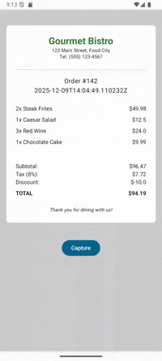
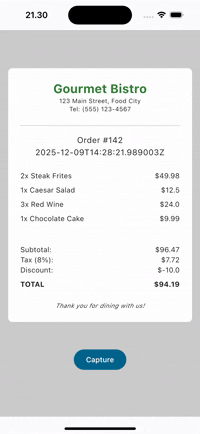

# Kotlin Multiplatform Screenshot Library for Jetpack Compose

A lightweight Kotlin Multiplatform library for capturing Jetpack Compose composables as image bitmaps. Supports Android and iOS. Easily take screenshots of your composables for testing, previews, or sharing.

### 🚀 Features:
- Capture any composable as an image bitmap
- Supports Jetpack Compose on Android and iOS
- Easy-to-use API for seamless integration
- **Built-in Share Sheet**: Easily share captured images using the native share sheet on Android and iOS.

### 🎥 Demo

📱 Android Demo           |  🍏 iOS Demo
:-------------------------:|:-------------------------:
  |  

### 📦 Installation & Usage:
Simply add the dependency and start capturing your composables!

```kotlin
implementation("io.github.suwasto:kmp-capturable-compose:$version")
```

### 🚀 Usage Example

Start by creating a `CapturableBoxController` to manage the capture process and trigger captures programmatically.

For a complete example, check out the [sharedUi](sharedUi) directory in the repository, which contains the usage of UI components and utilities for capturing screenshots.

#### 1. Basic Capture (Get ImageBitmap)
If you want to handle the captured `ImageBitmap` yourself (e.g., save it to a file, process it), you can call `capture()` on the controller.

```kotlin
val captureController = rememberCaptureBoxController()
val scope = rememberCoroutineScope()

Column {
    Button(onClick = {
        scope.launch {
           val bitmap = captureController.capture()
           // do something with the bitmap
        }
    }) {
        Text("Capture Screenshot")
    }

    CapturableBox(
        captureController = captureController
    ) {
        Content() // Replace with your composable content
    }
}
```

This library provides an extension function to convert `ImageBitmap` into a `ByteArray`, making it easy to save captured images. 🚀

#### 2. Capture and Share (Native Share Sheet)
You can directly share the captured image using the native OS share sheet by using `rememberShareSheet()` and passing it to the `CapturableBox` composable.

```kotlin
val captureController = rememberCaptureBoxController()
val shareSheet = rememberShareSheet()
val scope = rememberCoroutineScope()

Column {
    Button(onClick = {
        scope.launch {
            // Trigger capture, the sharing will be handled automatically by CapturableBox
            captureController.capture()
        }
    }) {
        Text("Share Screenshot")
    }

    CapturableBox(
        captureController = captureController,
        shareSheet = shareSheet // Pass the shareSheet instance
    ) {
        Content() // Replace with your composable content
    }
}
```

The library handles the file creation (caching) and launching the share intent (Android) or activity view controller (iOS) automatically.

#### 3. Custom Share Sheet
If the built-in `ShareSheet` doesn't fit your needs, you can implement your own by implementing the `ShareSheet` interface.

```kotlin
class MyCustomShareSheet : ShareSheet {
    override fun share(image: ImageBitmap) {
        // Implement your custom sharing logic here
    }
}
```

Then pass your custom implementation to `CapturableBox`:

```kotlin
val myShareSheet = remember { MyCustomShareSheet() }

CapturableBox(
    captureController = captureController,
    shareSheet = myShareSheet
) {
    Content()
}
```

### 📄 License

```
Copyright 2024 Anang Suwasto

Licensed under the Apache License, Version 2.0 (the "License");
you may not use this file except in compliance with the License.
You may obtain a copy of the License at

    http://www.apache.org/licenses/LICENSE-2.0

Unless required by applicable law or agreed to in writing, software
distributed under the License is distributed on an "AS IS" BASIS,
WITHOUT WARRANTIES OR CONDITIONS OF ANY KIND, either express or implied.
See the License for the specific language governing permissions and
limitations under the License.
```
